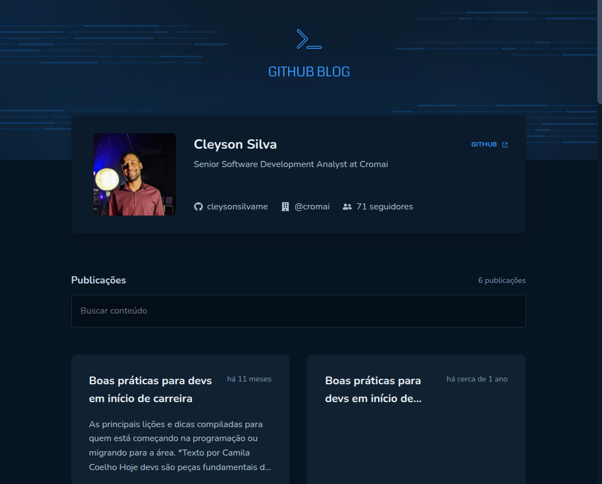

<h1 align="center">
Github Blog
</h1>

  <a href="#-tecnologias">Tecnologias</a>&nbsp;&nbsp;&nbsp;|&nbsp;&nbsp;&nbsp;
  <a href="#-projeto">Projeto</a>&nbsp;&nbsp;&nbsp;|&nbsp;&nbsp;&nbsp;
  <a href="#-layout">Layout</a>&nbsp;&nbsp;&nbsp;|&nbsp;&nbsp;&nbsp;
  <a href="#memo-licenca">Licença</a>

  

  

  

  

## 🚀 Tecnologias

Este projeto foi desenvolvido com as seguintes tecnologias:

- React
- TypeScript
- Vite
- Styled-components
- React Query
- Axios

## 💻 Projeto

O Github Blog é uma aplicação desenvolvida durante o desafio 03 do Ignite React da Rocketseat. O objetivo é consumir a API do Github para listar publicações (issues) de um repositório, exibir detalhes de cada publicação e permitir busca por posts.

## 🔖 Layout

O layout base foi fornecido pela Rocketseat e pode ser visualizado no Figma através [deste link](https://www.figma.com/file/pFj1bQ9QnQbF1Qw1Qw1Qw1/GitHub-Blog-Ignite-React). É necessário ter uma conta no [Figma](https://figma.com) para acessá-lo.

## :memo: Licença

Veja o arquivo [LICENSE](LICENSE) para mais detalhes.

### Autor

---

<a href="https://github.com/cleysonsilvame/" title="Cleyson Silva">
 
  

<b>Cleyson Silva</b> 🚀</a>

👋🏽 Entre em contato!

 
